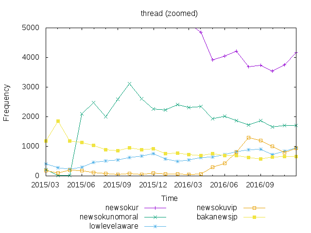

# Reddit jp stat

**注意**：`_`から始まるブランチは削除される可能性があります。

日本語圏のRedditについてグラフを書く。


## 必要なコマンド

* [subm](https://github.com/demmc/subm)
* gawk
* gnuplot

## 使い方

```sh
	# `subreddits.txt`に書かれたサブレディットを取得する。
	# 時間がかかるため注意。
	make fetch               -> r/*/*.{tsv,json}
	# 集計
	make data                -> r/*/*.data data/*.data
	# グラフを書く。
	make plot                -> r/*/*.png data/*.png

	# これらすべてを行う
	make
```

## 集計結果

ユーザ数は一ヶ月の間に一回以上スレッドを立てたユーザの数を表す。

データはその月の日数で正規化した。
`得点＝一日あたりの得点 × 30日` とした。

グラフに使ったデータは[data](data/)ディレクトリの`.data`ファイルを参照。
また、こっちで[表](data/table.md)にした。

### 2016/12のランキング

#### スコア数


---

#### コメント数


---

#### スレッド数


---

#### ユーザ数


---

### 5大サブレの推移

 | 全体版 | ズーム版
--- | --- | ---
スコア |  | 
コメント |  | 
スレッド |  | 
ユーザ |  | 


## LICENSE

MIT
