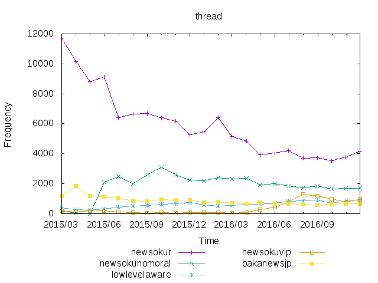
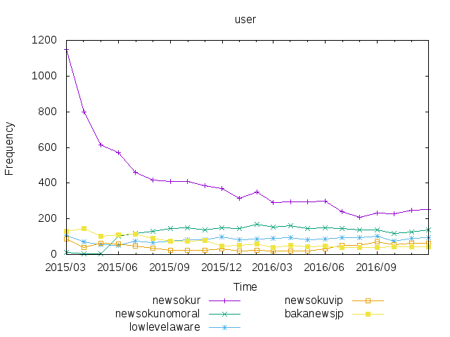

# Reddit jp stat

日本語園のRedditについてグラフを書く。


## 使い方

```sh
	# `subreddits.txt`に書かれたサブレディットを取得する。
	# 時間がかかるため注意。
	./get-all.sh -a -b -s  # -> /r/*/submissions.{json,tsv}
	# データを集計する
	./mk-stat.sh                   # -> /data/*.data
	# グラフを書く。
	./plot-stat.sh                 # -> /data/*.png
```

おまけ

```sh
	# スコアの分布とかを集計する。
	( cd r/newsokur; mk-data.sh )   # -> /r/newsokur/*.data
	# そのグラフを書く。
	( cd r/newsokur; ./plot.sh )    # -> /r/newsokur/*.png
	# すべてのサブレディットについて書く場合はこちら。
	./apply-all.sh mk-data.sh       # -> /r/*/*.data
	./apply-all.sh plot.sh          # -> /r/*/*.png
```

```sh
	# `/data/`以下の.dataファイルMarkdownで表にする。
	./to-table.sh  # -> /data/table.md
```

## 集計結果

ユーザ数は一ヶ月の間に一回以上スレッドを立てたユーザの数を表す。

グラフに使ったデータは[data](data/)ディレクトリの`.data`ファイルを参照。
また、こっちで[表](data/table.md)にした。

### 2016/12のランキング

#### スコア数


---

#### コメント数


---

#### スレッド数


---

#### ユーザ数


---

### 5大サブレの推移

 | 全体版 | ズーム版
--- | --- | ---
スコア |  | 
コメント |  | 
スレッド |  | 
ユーザ |  | 


## LICENSE

MIT
