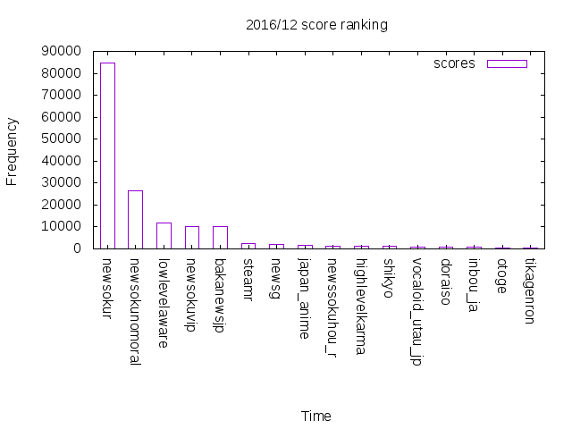
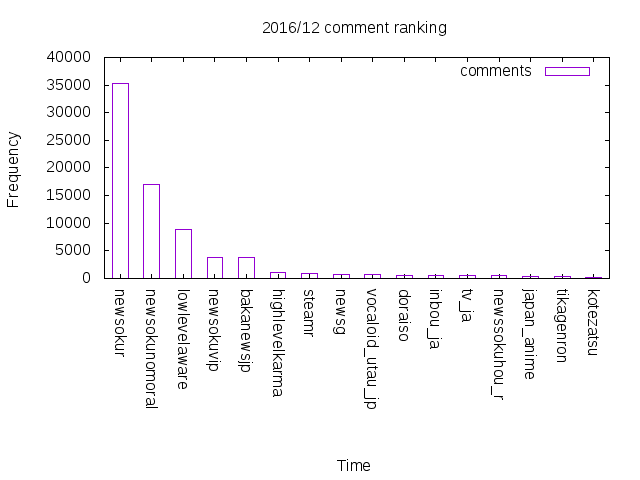
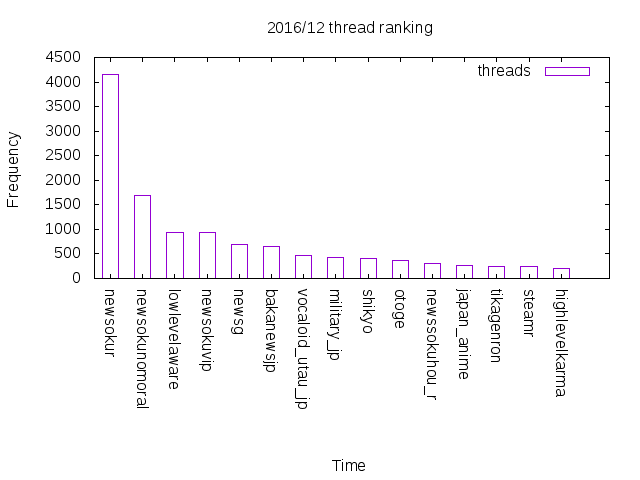
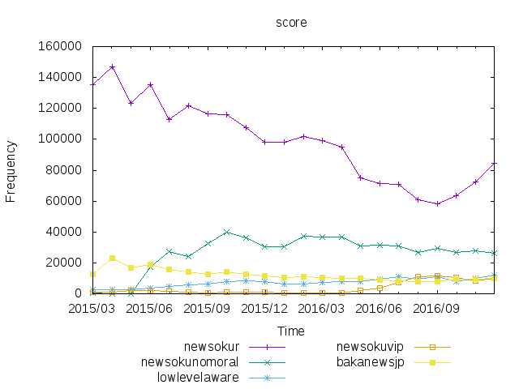
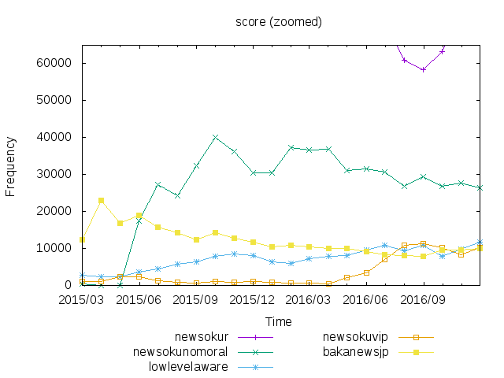
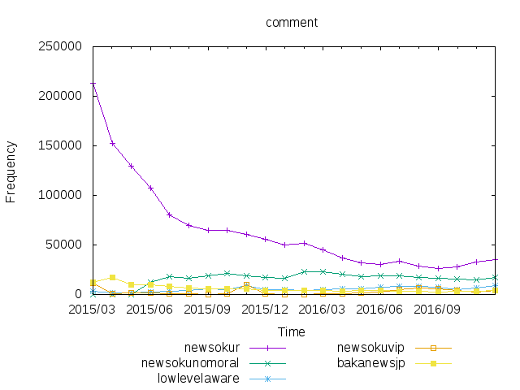
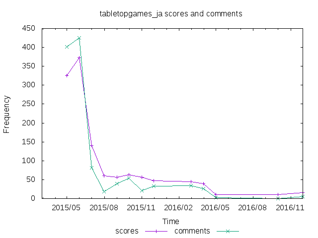

# Reddit jp stat

日本語圏のRedditについてグラフ描いたよー。
あと、提案。


目次

* 方法
* 2016/12のランキング
* 5大サブレの推移
* 縮んだサブレ
* 提案

---

## 方法

サブレリストを[レディッチ](http://reddit-watch.herokuapp.com/subrelist)から取得し、それぞれのサブレについて[ここ](https://www.reddit.com/wiki/search)のCloudsearch Syntaxで2015/03から2016/12までのスレを取得した。
スレがまったくないサブレは無視しています。

注意

データは`得点＝一日あたりの得点 × 30日`のように正規化し小数点以下を四捨五入した。

グラフに使ったデータは[data](data/)ディレクトリの`.data`ファイルを参照。
また、こっちで[表](data/table.md)にした。

---

## 2016/12のランキング

2016/12のそれぞれのサブレの（スコア数、コメント数、スレッド数、ユーザ数）の合計を調べた。

* スコア数＝すべてのスレのスコア数の合計
* コメント数＝すべてのスレのコメント数の合計
* スレッド数＝期間内のスレッド（サブミッション）の数
* ユーザ数＝1ヶ月の間に1回以上スレを立てたユーザの数


### スコア数



---

### コメント数



---

### スレッド数



---

### ユーザー数


---

↓表にするとこう

rank | score | comment | thread | user
--- | --- | --- | --- | ---
1 | [/r/newsokur](https://reddit.com/r/newsokur) | [/r/newsokur](https://reddit.com/r/newsokur) | [/r/newsokur](https://reddit.com/r/newsokur) | [/r/newsokur](https://reddit.com/r/newsokur)
2 | [/r/newsokunomoral](https://reddit.com/r/newsokunomoral) | [/r/newsokunomoral](https://reddit.com/r/newsokunomoral) | [/r/newsokunomoral](https://reddit.com/r/newsokunomoral) | [/r/newsokunomoral](https://reddit.com/r/newsokunomoral)
3 | [/r/lowlevelaware](https://reddit.com/r/lowlevelaware) | [/r/lowlevelaware](https://reddit.com/r/lowlevelaware) | [/r/lowlevelaware](https://reddit.com/r/lowlevelaware) | [/r/lowlevelaware](https://reddit.com/r/lowlevelaware)
4 | [/r/newsokuvip](https://reddit.com/r/newsokuvip) | [/r/newsokuvip](https://reddit.com/r/newsokuvip) | [/r/newsokuvip](https://reddit.com/r/newsokuvip) | [/r/newsokuvip](https://reddit.com/r/newsokuvip)
5 | [/r/bakanewsjp](https://reddit.com/r/bakanewsjp) | [/r/bakanewsjp](https://reddit.com/r/bakanewsjp) | [/r/newsg](https://reddit.com/r/newsg) | [/r/bakanewsjp](https://reddit.com/r/bakanewsjp)
6 | [/r/steamr](https://reddit.com/r/steamr) | [/r/highlevelkarma](https://reddit.com/r/highlevelkarma) | [/r/bakanewsjp](https://reddit.com/r/bakanewsjp) | [/r/steamr](https://reddit.com/r/steamr)
7 | [/r/newsg](https://reddit.com/r/newsg) | [/r/steamr](https://reddit.com/r/steamr) | [/r/vocaloid_utau_jp](https://reddit.com/r/vocaloid_utau_jp) | [/r/japan_anime](https://reddit.com/r/japan_anime)
8 | [/r/japan_anime](https://reddit.com/r/japan_anime) | [/r/newsg](https://reddit.com/r/newsg) | [/r/military_jp](https://reddit.com/r/military_jp) | [/r/highlevelkarma](https://reddit.com/r/highlevelkarma)
9 | [/r/newssokuhou_r](https://reddit.com/r/newssokuhou_r) | [/r/vocaloid_utau_jp](https://reddit.com/r/vocaloid_utau_jp) | [/r/shikyo](https://reddit.com/r/shikyo) | [/r/kojiki](https://reddit.com/r/kojiki)
10 | [/r/highlevelkarma](https://reddit.com/r/highlevelkarma) | [/r/doraiso](https://reddit.com/r/doraiso) | [/r/otoge](https://reddit.com/r/otoge) | [/r/programming_jp](https://reddit.com/r/programming_jp)
11 | [/r/shikyo](https://reddit.com/r/shikyo) | [/r/inbou_ja](https://reddit.com/r/inbou_ja) | [/r/newssokuhou_r](https://reddit.com/r/newssokuhou_r) | [/r/gamenews_ja](https://reddit.com/r/gamenews_ja)
12 | [/r/vocaloid_utau_jp](https://reddit.com/r/vocaloid_utau_jp) | [/r/tv_ja](https://reddit.com/r/tv_ja) | [/r/japan_anime](https://reddit.com/r/japan_anime) | [/r/software_ja](https://reddit.com/r/software_ja)
13 | [/r/doraiso](https://reddit.com/r/doraiso) | [/r/newssokuhou_r](https://reddit.com/r/newssokuhou_r) | [/r/tikagenron](https://reddit.com/r/tikagenron) | [/r/polandballjapanese](https://reddit.com/r/polandballjapanese)
14 | [/r/inbou_ja](https://reddit.com/r/inbou_ja) | [/r/japan_anime](https://reddit.com/r/japan_anime) | [/r/steamr](https://reddit.com/r/steamr) | [/r/jisakupc](https://reddit.com/r/jisakupc)
15 | [/r/otoge](https://reddit.com/r/otoge) | [/r/tikagenron](https://reddit.com/r/tikagenron) | [/r/highlevelkarma](https://reddit.com/r/highlevelkarma) | [/r/gamemusic_jp](https://reddit.com/r/gamemusic_jp)


---

やっぱりニュー速Rが最強ですね。
日本語圏の主要サブレは[ニュー速R](https://reddit.com/r/newsokur)、[ノーモラ](https://reddit.com/r/newsokunomoral)、[LLL](https://reddit.com/r/lowlevelaware)、[VIP](https://reddit.com/r/newsokuvip)、[バカニュー](https://reddit.com/r/bakanewsjp)の5つと言えそうです。
LLL、VIPが大健闘で、特にVIPはいつの間にやらに大きくなっていました。
バカニューがこの2つに越されていたのが意外でした。

LLLとVIPはスレッド数がほぼ同じですが、コメント数はLLLのほうが2倍ぐらいあります。
雑談サブレとしての成熟度が現れているのかも？

また、スコア数、コメント数では5大サブレが圧倒的ですが、スレッド数、ユーザ数ではそれほど離されていないですね。


## 5大サブレの推移

* [/r/newsokur](https://reddit.com/r/newsokur)
* [/r/newsokunomoral](https://reddit.com/r/newsokunomoral)
* [/r/lowlevelaware](https://reddit.com/r/lowlevelaware)
* [/r/newsokuvip](https://reddit.com/r/newsokuvip)
* [/r/bakanewsjp](https://reddit.com/r/bakanewsjp)

この5つ。
ニュー速Rがでかすぎて他が見にくいのでズーム版あり。

 | 全体版 | ズーム版
--- | --- | ---
スコア数 |  | 
コメント数 |  | 
スレッド数 |  | 
ユーザ数 |  | 

ニュー速Rが2016年9月から右上がりになっていますが、この頃何かあったんですかね。
2chからの流入かな。
ノーモラ、LLLで10月、11月からユーザ数とかコメント数が増えているのもその影響っぽいですね。

VIPは2016年6月から急成長、LLLは少し下がることがあっても全体としては右肩上がり。
それに対してバカニューはゆるく減少傾向が続いています。
ノーモラも減少傾向ですね。

十分大きくて人がいるサブレでも縮んでしまう、というのは日本語圏Redditの運用において注目すべきところだと思います。

---

## 縮んだサブレ

できた当初はそこそこ人がいたけど今では小さくなってしまったサブレを探してみました。
サブレの1ヶ月目はスティッキースレに2、3ヶ月分のコメント、スコアが集まって数値が大きくなりやすいことに注意してください。


サブレ | スコア数とコメント数 | ユーザ数とスレッド数
--- | --- | ---
[/r/ahotalk](https://reddit.com/r/ahotalk) |  | 
[/r/babymetal_japan](https://reddit.com/r/babymetal_japan) |  | 
[/r/consolegame](https://reddit.com/r/consolegame) |  | 
[/r/cooking_ja](https://reddit.com/r/cooking_ja) |  | 
[/r/drunk_ja](https://reddit.com/r/drunk_ja) |  | 
[/r/eigo](https://reddit.com/r/eigo) |  | 
[/r/engei](https://reddit.com/r/engei) |  | 
[/r/fallout4_ja](https://reddit.com/r/fallout4_ja) |  | 
[/r/foodporn_ja](https://reddit.com/r/foodporn_ja) |  | 
[/r/giron](https://reddit.com/r/giron) |  | 
[/r/hanjuku](https://reddit.com/r/hanjuku) |  | 
[/r/japan_anime](https://reddit.com/r/japan_anime) |  | 
[/r/kancolle_ja](https://reddit.com/r/kancolle_ja) |  | 
[/r/kusosure](https://reddit.com/r/kusosure) |  | 
[/r/lovelive_ja](https://reddit.com/r/lovelive_ja) |  | 
[/r/nanj](https://reddit.com/r/nanj) |  | 
[/r/newssokuhou_r](https://reddit.com/r/newssokuhou_r) |  | 
[/r/nintendo_jp](https://reddit.com/r/nintendo_jp) |  | 
[/r/pokemongo_ja](https://reddit.com/r/pokemongo_ja) |  | 
[/r/puzzleanddragons_ja](https://reddit.com/r/puzzleanddragons_ja) |  | 
[/r/rakugakicho](https://reddit.com/r/rakugakicho) |  | 
[/r/science_jp](https://reddit.com/r/science_jp) |  | 
[/r/sokur2](https://reddit.com/r/sokur2) |  | 
[/r/tabletopgames_ja](https://reddit.com/r/tabletopgames_ja) |  | 
[/r/writejpn_eigodekakou](https://reddit.com/r/writejpn_eigodekakou) |  | 
[/r/yaoru](https://reddit.com/r/yaoru) |  | 
[/r/yjsnpi](https://www.reddit.com/r/yjsnpi) |  | 


（その他のサブレについても同様のグラフを見たい方は[こちら](subreddits-all.md)（画像が700枚以上あるので注意）。）

けっこう知らないサブレも多かったんじゃないでしょうか。
優良サブレな[やろう！](https://reddit.com/r/yarou)とか2chから移住があった[Fallout4](https://reddit.com/r/Fallout4_ja)まで縮むのが悲しいです。
日本語圏Redditが盛り上がっていくにはこういうサブレを支援できるかどうかが鍵になると思います。

これによるとこれらサブレは始めの2、3ヶ月は書き込みがあっても徐々に縮みました。
これは有志の人が当初頑張って盛り上げていても、新規の人が入ってこないとガス欠になるということではないでしょうか。
↓こういうふうに。

1. 主要サブレで宣伝する→人が入ってくる
1. 有志の人(Modとか興味ある人)が頑張って盛り上げる→熱量低い人も書き込む
1. 盛り上がる！
1. (※) (新規の人が入ってこない)
1. 時間が経つにつれ熱量低い人が消えていく
1. 有志がバテる
1. 過疎る

うまくいっているコミュニティではある程度の大きさになったときに、一見さんが入ってくる流れができるんだと思います。
ここでは(※)のところで単発スレ立て以外の入り口を確保するのが必要だったんだと思います。


## 提案

ということで提案なのですがサイドバーに他サブレを貼るのはどうでしょうか。
今は[レディッチ](http://reddit-watch.herokuapp.com/)が貼ってありますが、やはりサイドバーに直であったほうがわかりやすいので。

↓こんな感じで

```
おすすめ
	★ニュー速ノーモラル
	★LLL
	★ニュー速VIP
	★バカニュース

ニュース
	○newsg
	△sokur2
	...

雑談
	○落書き帳
	△糞スレ
	▽ふぇぇ
	▽酒飲み
	...

創作
	○Zartan
	★お絵かき
	△半熟
	...

ゲーム
	▽ポケモンGO
	○艦これ
	△ラブライブ
	...
...
```

★、○、△、▽はそのときのサブレの活発度に応じてつくアイコンをイメージしています。
例えばボットを使って直近3日間の書き込み数を基準に定期的に更新する感じです。
ただ、ボットの開発とかありますし必須じゃないです。

重要なのは「カテゴリ分けする」「人がいるところを載せる」ということだと思います。

[サブレ一覧](https://www.reddit.com/r/newsokur/wiki/simple_list_ja)は人がいないところも載ってて多すぎるため、新しく来た人へのサブレ紹介として役に立ちません。
定着してもらえるよう人がいるところをわかりやすく載せるのが重要だと思います。
また、かつて賑わっていた（＝テーマ自体には人気がある）サブレも次点として扱っていいと思います。

---

まずは細かいことはとりあえず置いといて、5大サブレを載せることを提案します。
それ以外にどこを載せるかとかは少し揉めそうなので。

↓こんな感じ

```
おすすめ

* /r/newsokunomoral
* /r/lowlevelaware
* /r/newsokuvip
* /r/bakanewsjp
```

### 参考

↓ 2016/12の各サブレをコメント数でソートした表  
「コメント/スレッド比」はコメント数をスレッド数で割ったやつです。

サブレ | スコア | コメント | スレッド | ユーザ | コメント/スレッド比
--- | --- | --- | --- | --- | ---
[/r/newsokur](https://www.reddit.com/r/newsokur) | 84703 | 35374 | 4156 | 250 | 8.51155
[/r/newsokunomoral](https://www.reddit.com/r/newsokunomoral) | 26386 | 16948 | 1700 | 138 | 9.96941
[/r/lowlevelaware](https://www.reddit.com/r/lowlevelaware) | 11814 | 8903 | 945 | 96 | 9.42116
[/r/newsokuvip](https://www.reddit.com/r/newsokuvip) | 10167 | 3817 | 930 | 61 | 4.1043
[/r/bakanewsjp](https://www.reddit.com/r/bakanewsjp) | 10063 | 3720 | 658 | 43 | 5.6535
[/r/highlevelkarma](https://www.reddit.com/r/highlevelkarma) | 1276 | 1135 | 194 | 15 | 5.85052
[/r/steamr](https://www.reddit.com/r/steamr) | 2525 | 834 | 236 | 26 | 3.5339
[/r/newsg](https://www.reddit.com/r/newsg) | 2223 | 665 | 694 | 8 | 0.958213
[/r/vocaloid_utau_jp](https://www.reddit.com/r/vocaloid_utau_jp) | 864 | 657 | 467 | 6 | 1.40685
[/r/doraiso](https://www.reddit.com/r/doraiso) | 705 | 627 | 129 | 9 | 4.86047
[/r/inbou_ja](https://www.reddit.com/r/inbou_ja) | 665 | 535 | 121 | 6 | 4.42149
[/r/tv_ja](https://www.reddit.com/r/tv_ja) | 145 | 486 | 33 | 5 | 14.7273
[/r/newssokuhou_r](https://www.reddit.com/r/newssokuhou_r) | 1341 | 464 | 315 | 4 | 1.47302
[/r/japan_anime](https://www.reddit.com/r/japan_anime) | 1439 | 417 | 265 | 25 | 1.57358
[/r/tikagenron](https://www.reddit.com/r/tikagenron) | 570 | 291 | 247 | 5 | 1.17814
[/r/kotezatsu](https://www.reddit.com/r/kotezatsu) | 73 | 266 | 31 | 2 | 8.58065
[/r/jisakupc](https://www.reddit.com/r/jisakupc) | 493 | 251 | 30 | 11 | 8.36667
[/r/polandballjapanese](https://www.reddit.com/r/polandballjapanese) | 258 | 218 | 34 | 11 | 6.41176
[/r/keiba](https://www.reddit.com/r/keiba) | 152 | 211 | 43 | 1 | 4.90698
[/r/nintendo_jp](https://www.reddit.com/r/nintendo_jp) | 291 | 209 | 63 | 7 | 3.31746
[/r/newsokumoral](https://www.reddit.com/r/newsokumoral) | 477 | 204 | 106 | 4 | 1.92453
[/r/kancolle_ja](https://www.reddit.com/r/kancolle_ja) | 192 | 189 | 28 | 7 | 6.75
[/r/yuri_jp](https://www.reddit.com/r/yuri_jp) | 562 | 174 | 135 | 9 | 1.28889
[/r/rakugakicho](https://www.reddit.com/r/rakugakicho) | 255 | 146 | 18 | 9 | 8.11111
[/r/otoge](https://www.reddit.com/r/otoge) | 598 | 141 | 375 | 7 | 0.376
[/r/military_jp](https://www.reddit.com/r/military_jp) | 507 | 132 | 431 | 3 | 0.306265
[/r/fuee](https://www.reddit.com/r/fuee) | 312 | 121 | 23 | 9 | 5.26087
[/r/kaleidoscope_ja](https://www.reddit.com/r/kaleidoscope_ja) | 2 | 109 | 1 | 1 | 109
[/r/eiganews](https://www.reddit.com/r/eiganews) | 297 | 107 | 170 | 3 | 0.629412
[/r/shikyo](https://www.reddit.com/r/shikyo) | 1174 | 104 | 400 | 2 | 0.26
[/r/tvdrama_jp](https://www.reddit.com/r/tvdrama_jp) | 27 | 96 | 15 | 3 | 6.4
[/r/pokemongo_ja](https://www.reddit.com/r/pokemongo_ja) | 64 | 93 | 12 | 8 | 7.75
[/r/kojiki](https://www.reddit.com/r/kojiki) | 406 | 84 | 34 | 14 | 2.47059
[/r/oekaki_ja](https://www.reddit.com/r/oekaki_ja) | 275 | 83 | 11 | 6 | 7.54545
[/r/soccer_jp](https://www.reddit.com/r/soccer_jp) | 213 | 80 | 29 | 6 | 2.75862
[/r/motorcycle_ja](https://www.reddit.com/r/motorcycle_ja) | 117 | 79 | 40 | 2 | 1.975
[/r/software_ja](https://www.reddit.com/r/software_ja) | 336 | 76 | 34 | 11 | 2.23529
[/r/science_jp](https://www.reddit.com/r/science_jp) | 106 | 75 | 16 | 4 | 4.6875
[/r/programming_jp](https://www.reddit.com/r/programming_jp) | 197 | 73 | 24 | 13 | 3.04167
[/r/sky_ja](https://www.reddit.com/r/sky_ja) | 194 | 73 | 59 | 6 | 1.23729
[/r/quake_jp](https://www.reddit.com/r/quake_jp) | 61 | 69 | 12 | 4 | 5.75
[/r/stationery_jp](https://www.reddit.com/r/stationery_jp) | 65 | 63 | 15 | 3 | 4.2
[/r/imas_ja](https://www.reddit.com/r/imas_ja) | 43 | 63 | 10 | 4 | 6.3
[/r/tobacco_ja](https://www.reddit.com/r/tobacco_ja) | 57 | 58 | 7 | 6 | 8.28571
[/r/sugaku](https://www.reddit.com/r/sugaku) | 47 | 58 | 16 | 2 | 3.625
[/r/pripara_ja](https://www.reddit.com/r/pripara_ja) | 69 | 55 | 12 | 3 | 4.58333
[/r/skyrimmod_jp](https://www.reddit.com/r/skyrimmod_jp) | 219 | 53 | 116 | 1 | 0.456897
[/r/shogir](https://www.reddit.com/r/shogir) | 55 | 52 | 17 | 2 | 3.05882
[/r/plasticmodel_ja](https://www.reddit.com/r/plasticmodel_ja) | 76 | 47 | 19 | 6 | 2.47368
[/r/yjsnpi](https://www.reddit.com/r/yjsnpi) | 113 | 45 | 26 | 6 | 1.73077
[/r/geinounews](https://www.reddit.com/r/geinounews) | 102 | 45 | 54 | 4 | 0.833333
[/r/nanj](https://www.reddit.com/r/nanj) | 150 | 43 | 23 | 9 | 1.86957
[/r/dokusyo_syoseki_r](https://www.reddit.com/r/dokusyo_syoseki_r) | 69 | 43 | 7 | 4 | 6.14286
[/r/motorsports_ja](https://www.reddit.com/r/motorsports_ja) | 102 | 42 | 33 | 3 | 1.27273
[/r/kokoro](https://www.reddit.com/r/kokoro) | 19 | 40 | 5 | 3 | 8
[/r/politics_ja](https://www.reddit.com/r/politics_ja) | 49 | 38 | 19 | 3 | 2
[/r/hackintosh_ja](https://www.reddit.com/r/hackintosh_ja) | 33 | 36 | 21 | 2 | 1.71429
[/r/foodporn_ja](https://www.reddit.com/r/foodporn_ja) | 261 | 35 | 13 | 5 | 2.69231
[/r/keizai](https://www.reddit.com/r/keizai) | 41 | 35 | 17 | 2 | 2.05882
[/r/apple_jp](https://www.reddit.com/r/apple_jp) | 105 | 32 | 36 | 5 | 0.888889
[/r/radio_ja](https://www.reddit.com/r/radio_ja) | 33 | 32 | 12 | 3 | 2.66667
[/r/lisp_ja](https://www.reddit.com/r/lisp_ja) | 341 | 30 | 147 | 2 | 0.204082
[/r/ongakur](https://www.reddit.com/r/ongakur) | 137 | 30 | 39 | 9 | 0.769231
[/r/okashi_ja](https://www.reddit.com/r/okashi_ja) | 39 | 28 | 13 | 5 | 2.15385
[/r/whistory_ja](https://www.reddit.com/r/whistory_ja) | 79 | 26 | 30 | 4 | 0.866667
[/r/bijutsu](https://www.reddit.com/r/bijutsu) | 44 | 26 | 15 | 3 | 1.73333
[/r/privacy_ja](https://www.reddit.com/r/privacy_ja) | 36 | 26 | 15 | 4 | 1.73333
[/r/monsterhunter_jp](https://www.reddit.com/r/monsterhunter_jp) | 20 | 26 | 6 | 3 | 4.33333
[/r/hearthstone_ja](https://www.reddit.com/r/hearthstone_ja) | 31 | 25 | 6 | 5 | 4.16667
[/r/gamenews_ja](https://www.reddit.com/r/gamenews_ja) | 134 | 24 | 38 | 13 | 0.631579
[/r/newsoku](https://www.reddit.com/r/newsoku) | 88 | 24 | 22 | 3 | 1.09091
[/r/sokur2](https://www.reddit.com/r/sokur2) | 64 | 24 | 14 | 3 | 1.71429
[/r/touhou_jp](https://www.reddit.com/r/touhou_jp) | 46 | 24 | 10 | 3 | 2.4
[/r/newsokuliberty](https://www.reddit.com/r/newsokuliberty) | 18 | 24 | 9 | 1 | 2.66667
[/r/antixmas_ja](https://www.reddit.com/r/antixmas_ja) | 123 | 23 | 20 | 5 | 1.15
[/r/sumo_ja](https://www.reddit.com/r/sumo_ja) | 48 | 23 | 13 | 1 | 1.76923
[/r/neet4r](https://www.reddit.com/r/neet4r) | 18 | 21 | 8 | 1 | 2.625
[/r/android_jp](https://www.reddit.com/r/android_jp) | 60 | 20 | 9 | 3 | 2.22222
[/r/baystars](https://www.reddit.com/r/baystars) | 34 | 18 | 8 | 2 | 2.25
[/r/lgbt_ja](https://www.reddit.com/r/lgbt_ja) | 26 | 18 | 3 | 2 | 6
[/r/j_sfx](https://www.reddit.com/r/j_sfx) | 20 | 18 | 7 | 2 | 2.57143
[/r/netservice_ja](https://www.reddit.com/r/netservice_ja) | 19 | 18 | 13 | 1 | 1.38462
[/r/twetch9](https://www.reddit.com/r/twetch9) | 98 | 17 | 40 | 3 | 0.425
[/r/jpn_history](https://www.reddit.com/r/jpn_history) | 26 | 17 | 10 | 2 | 1.7
[/r/sciencefiction_ja](https://www.reddit.com/r/sciencefiction_ja) | 11 | 17 | 6 | 1 | 2.83333
[/r/unusualsurvival_ja](https://www.reddit.com/r/unusualsurvival_ja) | 28 | 16 | 5 | 5 | 3.2
[/r/movie_ja](https://www.reddit.com/r/movie_ja) | 35 | 15 | 11 | 4 | 1.36364
[/r/petdaisuki](https://www.reddit.com/r/petdaisuki) | 30 | 15 | 22 | 1 | 0.681818
[/r/knives_ja](https://www.reddit.com/r/knives_ja) | 26 | 15 | 5 | 1 | 3
[/r/ja_manga](https://www.reddit.com/r/ja_manga) | 24 | 15 | 7 | 4 | 2.14286
[/r/panamapapers_jp](https://www.reddit.com/r/panamapapers_jp) | 23 | 15 | 5 | 2 | 3
[/r/consolegame](https://www.reddit.com/r/consolegame) | 15 | 15 | 7 | 6 | 2.14286
[/r/newsjoho](https://www.reddit.com/r/newsjoho) | 202 | 14 | 131 | 1 | 0.10687
[/r/occult_ja](https://www.reddit.com/r/occult_ja) | 55 | 14 | 15 | 4 | 0.933333
[/r/bicycle_ja](https://www.reddit.com/r/bicycle_ja) | 15 | 14 | 6 | 4 | 2.33333
[/r/netnovel_ja](https://www.reddit.com/r/netnovel_ja) | 13 | 13 | 9 | 3 | 1.44444
[/r/chiebukuro](https://www.reddit.com/r/chiebukuro) | 11 | 13 | 6 | 1 | 2.16667
[/r/todayilearned_jp](https://www.reddit.com/r/todayilearned_jp) | 30 | 12 | 8 | 3 | 1.5
[/r/cis_ja](https://www.reddit.com/r/cis_ja) | 20 | 12 | 3 | 2 | 4
[/r/fastfood_ja](https://www.reddit.com/r/fastfood_ja) | 9 | 12 | 7 | 1 | 1.71429
[/r/kokusaijyousei_ja](https://www.reddit.com/r/kokusaijyousei_ja) | 13 | 11 | 6 | 1 | 1.83333
[/r/hardware_ja](https://www.reddit.com/r/hardware_ja) | 47 | 10 | 8 | 4 | 1.25
[/r/mushoku_jp](https://www.reddit.com/r/mushoku_jp) | 43 | 10 | 7 | 3 | 1.42857
[/r/karada](https://www.reddit.com/r/karada) | 11 | 10 | 5 | 1 | 2
[/r/gamemusic_jp](https://www.reddit.com/r/gamemusic_jp) | 80 | 8 | 21 | 10 | 0.380952
[/r/cryptocurrency_ja](https://www.reddit.com/r/cryptocurrency_ja) | 57 | 8 | 21 | 2 | 0.380952
[/r/otakunetouyostudies](https://www.reddit.com/r/otakunetouyostudies) | 54 | 8 | 17 | 3 | 0.470588
[/r/gamedev_ja](https://www.reddit.com/r/gamedev_ja) | 28 | 8 | 5 | 2 | 1.6
[/r/oogiri](https://www.reddit.com/r/oogiri) | 20 | 8 | 3 | 2 | 2.66667
[/r/choujigengameneptune](https://www.reddit.com/r/choujigengameneptune) | 15 | 8 | 10 | 1 | 0.8
[/r/erogenews_ja](https://www.reddit.com/r/erogenews_ja) | 17 | 7 | 5 | 3 | 1.4
[/r/modclubhouse_ja](https://www.reddit.com/r/modclubhouse_ja) | 11 | 7 | 2 | 2 | 3.5
[/r/travel_ja](https://www.reddit.com/r/travel_ja) | 9 | 7 | 3 | 1 | 2.33333
[/r/blenderja](https://www.reddit.com/r/blenderja) | 9 | 7 | 1 | 1 | 7
[/r/nikujaga](https://www.reddit.com/r/nikujaga) | 4 | 7 | 1 | 1 | 7
[/r/webcomic_ja](https://www.reddit.com/r/webcomic_ja) | 87 | 6 | 40 | 2 | 0.15
[/r/sangokushi](https://www.reddit.com/r/sangokushi) | 43 | 6 | 10 | 3 | 0.6
[/r/sengoku](https://www.reddit.com/r/sengoku) | 39 | 6 | 13 | 1 | 0.461538
[/r/measures](https://www.reddit.com/r/measures) | 17 | 6 | 4 | 2 | 1.5
[/r/fireemblem_ja](https://www.reddit.com/r/fireemblem_ja) | 12 | 6 | 6 | 2 | 1
[/r/tabletopgames_ja](https://www.reddit.com/r/tabletopgames_ja) | 16 | 5 | 2 | 2 | 2.5
[/r/kinoko_jp](https://www.reddit.com/r/kinoko_jp) | 15 | 5 | 3 | 2 | 1.66667
[/r/100kin](https://www.reddit.com/r/100kin) | 10 | 5 | 1 | 1 | 5
[/r/ruins_jp](https://www.reddit.com/r/ruins_jp) | 9 | 5 | 2 | 2 | 2.5
[/r/chikuny](https://www.reddit.com/r/chikuny) | 6 | 5 | 1 | 1 | 5
[/r/engei](https://www.reddit.com/r/engei) | 15 | 4 | 3 | 2 | 1.33333
[/r/asciiart_jp](https://www.reddit.com/r/asciiart_jp) | 11 | 4 | 3 | 3 | 1.33333
[/r/pinkall](https://www.reddit.com/r/pinkall) | 6 | 4 | 2 | 1 | 2
[/r/pokemon_jp](https://www.reddit.com/r/pokemon_jp) | 5 | 4 | 2 | 1 | 2
[/r/kaden_ja](https://www.reddit.com/r/kaden_ja) | 5 | 4 | 2 | 1 | 2
[/r/backofleaflet_ja](https://www.reddit.com/r/backofleaflet_ja) | 1 | 4 | 1 | 1 | 4
[/r/yarou](https://www.reddit.com/r/yarou) | 15 | 3 | 1 | 1 | 3
[/r/dam_jp](https://www.reddit.com/r/dam_jp) | 13 | 3 | 3 | 3 | 1
[/r/hitomozi_ja](https://www.reddit.com/r/hitomozi_ja) | 8 | 3 | 2 | 2 | 1.5
[/r/adultvideo_ja](https://www.reddit.com/r/adultvideo_ja) | 8 | 3 | 2 | 1 | 1.5
[/r/editorial_jp](https://www.reddit.com/r/editorial_jp) | 4 | 3 | 2 | 2 | 1.5
[/r/cupnoodles_ja](https://www.reddit.com/r/cupnoodles_ja) | 4 | 3 | 2 | 1 | 1.5
[/r/ja](https://www.reddit.com/r/ja) | 90 | 2 | 28 | 5 | 0.0714286
[/r/linux_jp](https://www.reddit.com/r/linux_jp) | 15 | 2 | 1 | 1 | 2
[/r/eroson_jp](https://www.reddit.com/r/eroson_jp) | 14 | 2 | 5 | 1 | 0.4
[/r/security_ja](https://www.reddit.com/r/security_ja) | 11 | 2 | 2 | 2 | 1
[/r/css_ja](https://www.reddit.com/r/css_ja) | 8 | 2 | 2 | 1 | 1
[/r/browsergame_jp](https://www.reddit.com/r/browsergame_jp) | 7 | 2 | 3 | 2 | 0.666667
[/r/raspberry_pi_ja](https://www.reddit.com/r/raspberry_pi_ja) | 6 | 2 | 2 | 2 | 1
[/r/denpasong](https://www.reddit.com/r/denpasong) | 6 | 2 | 2 | 1 | 1
[/r/personalwebsite](https://www.reddit.com/r/personalwebsite) | 3 | 2 | 1 | 1 | 2
[/r/drunk_ja](https://www.reddit.com/r/drunk_ja) | 2 | 2 | 1 | 1 | 2
[/r/hanjuku](https://www.reddit.com/r/hanjuku) | 19 | 1 | 5 | 2 | 0.2
[/r/enhancement_ja](https://www.reddit.com/r/enhancement_ja) | 14 | 1 | 2 | 1 | 0.5
[/r/cthulhu_ja](https://www.reddit.com/r/cthulhu_ja) | 14 | 1 | 2 | 2 | 0.5
[/r/anison_jp](https://www.reddit.com/r/anison_jp) | 7 | 1 | 2 | 1 | 0.5
[/r/treeofsavior_jp](https://www.reddit.com/r/treeofsavior_jp) | 6 | 1 | 2 | 1 | 0.5
[/r/rugby_ja](https://www.reddit.com/r/rugby_ja) | 6 | 1 | 6 | 1 | 0.166667
[/r/retrogamejp](https://www.reddit.com/r/retrogamejp) | 5 | 1 | 1 | 1 | 1
[/r/pcgames_ja](https://www.reddit.com/r/pcgames_ja) | 5 | 1 | 1 | 1 | 1
[/r/futuu](https://www.reddit.com/r/futuu) | 5 | 1 | 2 | 2 | 0.5
[/r/wows_ja](https://www.reddit.com/r/wows_ja) | 3 | 1 | 2 | 1 | 0.5
[/r/jomon](https://www.reddit.com/r/jomon) | 3 | 1 | 1 | 1 | 1
[/r/creditcard_jp](https://www.reddit.com/r/creditcard_jp) | 3 | 1 | 1 | 1 | 1
[/r/nmr_r](https://www.reddit.com/r/nmr_r) | 2 | 1 | 1 | 1 | 1
[/r/mascotcharacter_ja](https://www.reddit.com/r/mascotcharacter_ja) | 1 | 1 | 1 | 1 | 1
[/r/gamemaker_ja](https://www.reddit.com/r/gamemaker_ja) | 1 | 1 | 1 | 1 | 1
[/r/eigo](https://www.reddit.com/r/eigo) | 1 | 1 | 1 | 1 | 1
[/r/animefigures_ja](https://www.reddit.com/r/animefigures_ja) | 32 | 0 | 11 | 1 | 0
[/r/citiesskylines_ja](https://www.reddit.com/r/citiesskylines_ja) | 7 | 0 | 1 | 1 | 0
[/r/chinshu](https://www.reddit.com/r/chinshu) | 7 | 0 | 2 | 1 | 0
[/r/charactorvoice](https://www.reddit.com/r/charactorvoice) | 7 | 0 | 2 | 1 | 0
[/r/sayjaaaaaaap](https://www.reddit.com/r/sayjaaaaaaap) | 6 | 0 | 1 | 1 | 0
[/r/iosgame_ja](https://www.reddit.com/r/iosgame_ja) | 6 | 0 | 3 | 1 | 0
[/r/babymetal_japan](https://www.reddit.com/r/babymetal_japan) | 6 | 0 | 1 | 1 | 0
[/r/guchi](https://www.reddit.com/r/guchi) | 5 | 0 | 1 | 1 | 0
[/r/musicmakers_ja](https://www.reddit.com/r/musicmakers_ja) | 4 | 0 | 1 | 1 | 0
[/r/sicp_ja](https://www.reddit.com/r/sicp_ja) | 3 | 0 | 3 | 1 | 0
[/r/minecraft_jp](https://www.reddit.com/r/minecraft_jp) | 3 | 0 | 1 | 1 | 0
[/r/league_of_legends_jp](https://www.reddit.com/r/league_of_legends_jp) | 3 | 0 | 2 | 2 | 0
[/r/gakusei_ja](https://www.reddit.com/r/gakusei_ja) | 3 | 0 | 1 | 1 | 0
[/r/employee_jp](https://www.reddit.com/r/employee_jp) | 3 | 0 | 1 | 1 | 0
[/r/progre_jp](https://www.reddit.com/r/progre_jp) | 2 | 0 | 1 | 1 | 0
[/r/onlinestorage_ja](https://www.reddit.com/r/onlinestorage_ja) | 2 | 0 | 1 | 1 | 0
[/r/okome](https://www.reddit.com/r/okome) | 2 | 0 | 1 | 1 | 0
[/r/kusosure](https://www.reddit.com/r/kusosure) | 2 | 0 | 1 | 1 | 0
[/r/erogazo](https://www.reddit.com/r/erogazo) | 2 | 0 | 1 | 1 | 0
[/r/entertainment_jp](https://www.reddit.com/r/entertainment_jp) | 2 | 0 | 1 | 1 | 0
[/r/dqx_jp](https://www.reddit.com/r/dqx_jp) | 2 | 0 | 1 | 1 | 0
[/r/suresoku](https://www.reddit.com/r/suresoku) | 1 | 0 | 1 | 1 | 0
[/r/reddit_ja](https://www.reddit.com/r/reddit_ja) | 1 | 0 | 3 | 1 | 0
[/r/newsokurplus](https://www.reddit.com/r/newsokurplus) | 1 | 0 | 1 | 1 | 0
[/r/charsenyou](https://www.reddit.com/r/charsenyou) | 1 | 0 | 1 | 1 | 0
[/r/assassinscreed_ja](https://www.reddit.com/r/assassinscreed_ja) | 1 | 0 | 1 | 1 | 0
